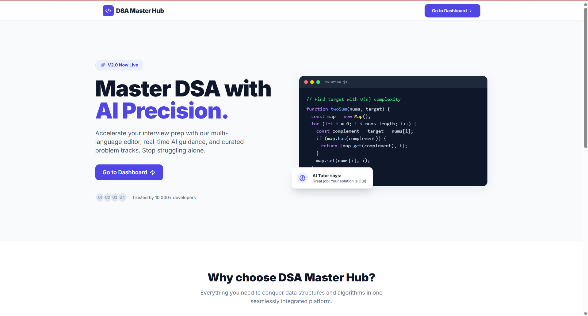
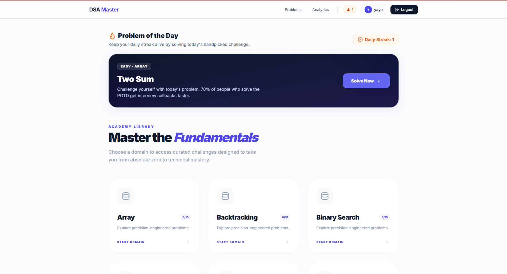
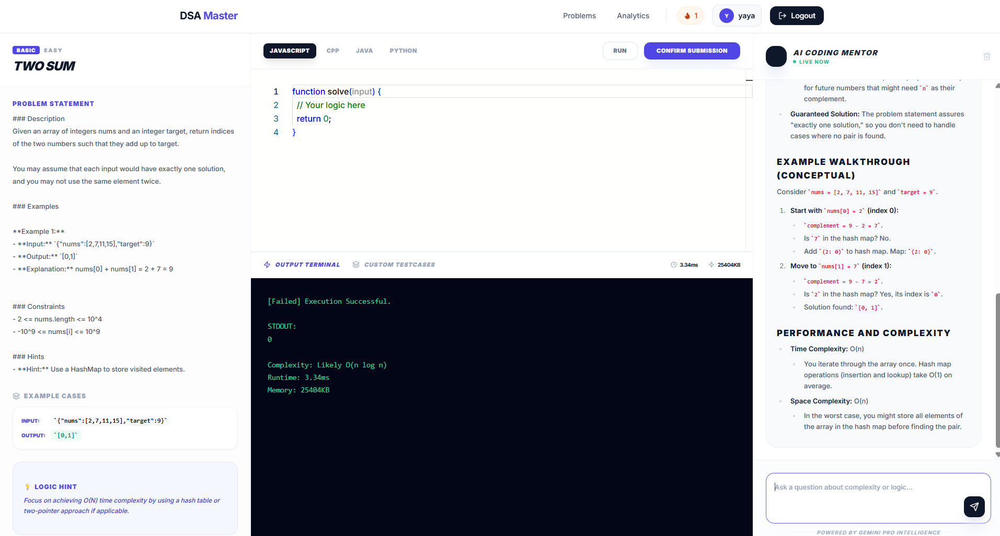
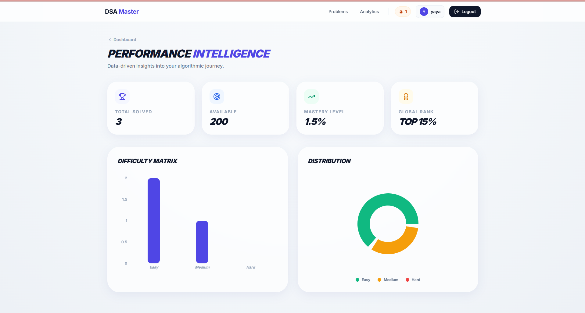

# 🚀 DSA Master Hub

**DSA Master Hub** is a premium, AI-powered Data Structures and Algorithms learning platform designed to help developers master coding interviews through interactive practice, real-time AI guidance, and comprehensive analytics.



## ✨ Key Features

-   **Premium Workspace**: A high-end coding environment powered by Monaco Editor (VS Code engine).
-   **AI Tutor**: Integrated AI mentor powered by Google Gemini that provides hints, complexity analysis, and debugging support.
-   **Problem of the Day (POTD)**: Handpicked daily challenges to build consistency and coding streaks.
-   **Multi-Language Support**: Support for JavaScript (Real-time VM execution), C++, Java, and Python (AI-simulated).
-   **Performance Analytics**: Deep insights into solved problems, difficulty distribution, and mastery levels using Recharts.
-   **Gamified Experience**: Build coding streaks and earn badges to stay motivated.

## 🛠️ Tech Stack

-   **Frontend**: React.js, Tailwind CSS, Lucide-React, Recharts, Vite.
-   **Backend**: Node.js, Express.js, JWT Authentication.
-   **Database**: MongoDB (Atlas).
-   **AI Intelligence**: Google Gemini API.

## 🚀 Getting Started

### Prerequisites

-   Node.js (v18 or higher)
-   MongoDB Atlas account
-   Gemini API Key

### Installation

1.  **Clone the Repository**:
    ```bash
    git clone https://github.com/your-username/dsa-master-hub.git
    cd dsa-master-hub
    ```

2.  **Setup Backend**:
    ```bash
    cd server
    npm install
    ```
    Create a `.env` file in the `server` directory:
    ```env
    PORT=5000
    MONGODB_URI=your_mongodb_atlas_uri
    JWT_SECRET=your_jwt_secret
    GEMINI_API_KEY=your_gemini_api_key
    ```
    Start server: `npm run dev`

3.  **Setup Frontend**:
    ```bash
    cd ../client
    npm install
    ```
    Create a `.env` file in the `client` directory:
    ```env
    VITE_API_URL=http://localhost:5000/api
    ```
    Start client: `npm run dev`

## 📸 Screenshots

| Dashboard | Coding Workspace | Analytics |
| :---: | :---: | :---: |
|  |  |  |

## 🛡️ License

Distributed under the MIT License. See `LICENSE` for more information.

---
Built with ❤️ by [Harshita]
